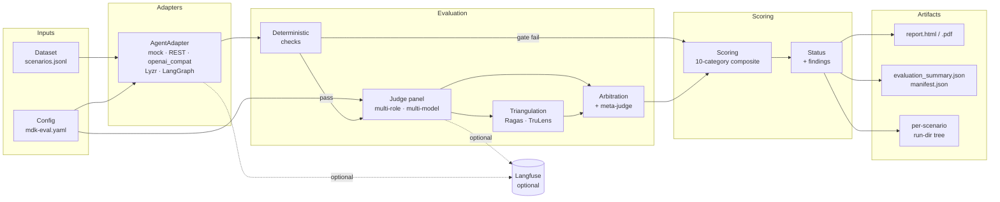

# Movate Agent Assurance — Product Requirements Document

**Product (platform)**: Movate Agent Assurance
**Component (CLI)**: `mdk-eval` — the reference implementation users install and invoke
**Version**: 1.0 (drafted post-Phase-1)
**Status**: Active development
**Last updated**: 2026-05-04
**Owner**: Movate Agent Assurance team
**Reviewers**: _(pending — Product, Engineering, Delivery, AI Risk)_
**License**: Proprietary — Movate (per `pyproject.toml`). See Q5 for the still-open packaging / commercial-distribution question.
**Audience**: Product leadership, engineering, customer-facing delivery, AI risk reviewers

> **Naming convention used in this document**: "Movate Agent Assurance" refers to the product / methodology / brand. `mdk-eval` refers specifically to the CLI binary, the Python package, and the configuration files users author. When in doubt: a customer buys Movate Agent Assurance; an engineer runs `mdk-eval`.

---

## Table of contents

1. [Executive summary](#1-executive-summary)
2. [Problem statement](#2-problem-statement)
3. [Goals and non-goals](#3-goals-and-non-goals)
4. [Target users and personas](#4-target-users-and-personas)
5. [Product principles](#5-product-principles)
6. [Functional requirements](#6-functional-requirements)
7. [Non-functional requirements](#7-non-functional-requirements)
8. [Architecture](#8-architecture)
9. [Key user workflows](#9-key-user-workflows)
10. [Trust and reproducibility guarantees](#10-trust-and-reproducibility-guarantees)
11. [Methodology versioning and stable contracts](#11-methodology-versioning-and-stable-contracts)
12. [Phased roadmap](#12-phased-roadmap)
13. [Success metrics](#13-success-metrics)
14. [Risks and mitigations](#14-risks-and-mitigations)
15. [Out of scope (explicit)](#15-out-of-scope-explicit)
16. [Open questions](#16-open-questions)
17. [Glossary](#17-glossary)

---

## 1. Executive summary

Movate Agent Assurance is a Python-first, CLI-driven evaluation system for AI agents, delivered via the `mdk-eval` tool. It scores agent reliability, classifies failures, and produces a Movate-branded report that gives a defensible answer to a single question:

> **Is this AI agent ready for production?**

It is not a benchmarking tool, a leaderboard, or a prompt-engineering playground. It is a reliability, QA, and production-readiness system for enterprise AI agents — the equivalent of unit tests, code review, and a security audit, applied to non-deterministic LLM-driven systems.

The product is designed to be **trustworthy under scrutiny**. Every score is reproducible, every judgment is traceable, every recommendation has evidence, and every artifact is version-pinned. Customers can hand the output to an AI risk committee.

---

## 2. Problem statement

Enterprises adopting AI agents (Lyzr, LangGraph, LangChain, custom REST agents) face three failure modes:

1. **Silent unreliability.** An agent that scores 90% on a curated test passes review and ships, then drifts in production. Average-only scoring hides variance.
2. **Untrusted evaluation.** Single-LLM-as-judge systems produce numbers no one defends in a stakeholder review. "GPT-4 said our agent is 8.5/10" is not a basis for a go-live decision.
3. **Unactionable output.** Existing eval tools dump metrics. None answer "what should we fix" or "is this safe to ship." Customers want a recommendation, not a leaderboard.

The result: AI deployments stall in pilot, get shipped on vibes, or fail in production. Movate needs a system that lets delivery teams produce defensible production-readiness evidence in hours, not weeks.

---

## 3. Goals and non-goals

### 3.1 Goals

| # | Goal | How it's measured |
|---|------|-------------------|
| G1 | Defensible production-readiness verdict | Every report ends with one of four status bands and the evidence trail to defend it |
| G2 | Reproducibility across runs and environments | SHA-256 pinning of dataset, prompts, configs, models. `replay` reproduces results within score variance bounds |
| G3 | Multi-layer evaluation (deterministic > probabilistic) | Deterministic checks gate everything; LLM judges are signal, not authority |
| G4 | Multi-judge arbitration with disagreement detection | Variance + spread tracked per role; meta-judge escalation on disagreement |
| G5 | Failure analysis, not just scores | Every failure carries class + reason + evidence + recommendation |
| G6 | Five-minute first-run experience | `mdk-eval init` → `mdk-eval doctor` → `mdk-eval run --dry-run` → `mdk-eval run` |
| G7 | CI-grade integration | `--gate-against` exits non-zero on regression. `--quiet` mode pipes parseable summary to stdout |
| G8 | Vendor-neutral architecture | Adapters for Lyzr, LangGraph, REST, OpenAI-compatible, mock. New backends added without touching evaluation code |
| G9 | Trust through transparency | Judge prompts, model versions, thresholds, weights all visible and hashed in every report |

### 3.2 Non-goals (summary)

The high-level positioning is: **not a prompt playground, not a leaderboard, not an inference platform, not a generic LLM eval framework, not a server.** The full enumerated list with rationale lives in [§15 Out of scope](#15-out-of-scope-explicit) — that section is the canonical source of truth.

---

## 4. Target users and personas

> **Sizing note.** The numbers below are the working assumptions used to size every NFR target in [§7](#7-non-functional-requirements) (concurrency limits, cost ceilings, retention defaults). Items tagged `[confirm]` are best-guesses that need validation from delivery leadership; if any are off by more than 2×, the corresponding NFR targets need to move.

### 4.1 Primary personas

**P1 — Movate Delivery Engineer**
*Goal*: ship an AI agent for a customer with defensible reliability evidence.
*Constraints*: tight timelines, customer scrutiny, multiple agent stacks (Lyzr today, LangGraph tomorrow).
*What they need*: one CLI that handles every backend; produces a client-ready report; runs in CI.
*Estimated population*: ~30 engineers across the AI delivery practice `[confirm]`
*Estimated usage*: 4–6 customer engagements/year per engineer, ~80 scenarios/dataset, 3 runs/scenario, ~10 evaluation runs over the life of an engagement `[confirm]`

**P2 — Customer AI Risk Reviewer**
*Goal*: decide whether to approve an AI agent for production traffic.
*Constraints*: must defend the decision to internal compliance, legal, security.
*What they need*: a report showing methodology, judge models, prompt hashes, scenario coverage, failure analysis, regression history.
*Estimated population per engagement*: 1–3 reviewers (typically: Head of AI Risk, an internal security partner, sometimes legal)
*Estimated usage*: reads the final report 1–3 times; never invokes the CLI directly

**P3 — Customer Engineering Lead**
*Goal*: know what to fix when an evaluation fails.
*Constraints*: limited bandwidth, wants prioritized fixes not raw metrics.
*What they need*: failure clusters, suggested fixes, regression diffs against prior runs.
*Estimated population per engagement*: 1–4 engineers on the agent build team
*Estimated usage*: invokes the CLI weekly during the engagement; reads the report after each run; uses `compare` and `replay` heavily during fix-and-rerun cycles

### 4.2 Secondary personas

**S1 — Customer Prompt Engineer** — uses our PromptFoo export to A/B test prompts in their existing workflow. Touchpoint: `mdk-eval export --format promptfoo` once or twice per engagement; everything else stays in PromptFoo.
**S2 — Customer SRE / On-call** — uses Langfuse trace export to debug production incidents. Touchpoint: never runs `mdk-eval`; reads Langfuse traces produced by the run.
**S3 — Movate Sales Engineer** — runs the tool against a prospect's agent during a POV; produces a report as a deliverable. Estimated 5–10 sales engineers `[confirm]`; ~6–12 POVs/year each.

---

## 5. Product principles

These are non-negotiable. They drive every design decision below.

1. **Deterministic before probabilistic.** A scenario that fails schema validation never reaches the LLM judges. Cheap, fast, hard checks gate expensive, slow, soft ones.
2. **Multi-judge by default.** No single LLM is authoritative. Every LLM-graded metric runs through ≥2 models; high-variance verdicts escalate to a stronger meta-judge.
3. **Reliability ≠ quality.** A high mean score with high variance is not production-ready. Multi-run is the default, not an option.
4. **Trace everything.** Inputs, outputs, tool calls, sub-agent hops, latencies, retries, judge prompts and verdicts. Auditability is a feature, not overhead.
5. **Version everything.** Every artifact records SHA-256 of dataset, judge prompts, model IDs, and config. Without this, no regression testing.
6. **Reports are actionable.** Every finding maps to a class, a reason, evidence, and a recommended fix. "Score = 0.62" is not actionable; "grounding judge flagged unsupported claim — strengthen retrieval" is.
7. **Provenance on derived artifacts.** Anything generated automatically (ingest scenarios, synthesized tests) carries source path, source SHA, extractor name, and the constraint quote it came from.
8. **Fail loudly, fail early.** Config errors raise before any work happens. Failed adapter calls don't waste judge tokens. Clear error messages with concrete fixes.
9. **CI-friendly stdout discipline.** Live UI to stderr; machine-parseable summary to stdout. Pipe the result of a run into a build gate without parsing screen scrapes.
10. **No magic.** Every judge prompt is visible. Every weight is in config. Every scoring formula is documented. Customers can defend the numbers without trusting us.

---

## 6. Functional requirements

### 6.1 CLI commands (Phase 1, shipped)

| Command | Purpose | Notes |
|---------|---------|-------|
| `mdk-eval init [path]` | Scaffold a new evaluation project | Interactive Rich prompts; `--vscode` adds debug configs; `--cd-script` for shell-eval auto-nav |
| `mdk-eval doctor` | Diagnose environment | Checks Python, env vars, optional extras, dataset validity, endpoint reachability |
| `mdk-eval run` | Execute an evaluation run | Auto-discovers `mdk-eval.yaml`; `--dry-run`, `--gate-against`, `--no-judges`, multi-run |
| `mdk-eval report` | Re-generate report from saved run dir | Interactive run picker if `--results` omitted |
| `mdk-eval compare` | Diff two run dirs | Picks twice (candidate + baseline); surfaces score deltas, regressions, status changes |
| `mdk-eval replay` | Re-run saved scenarios against (possibly different) endpoint | `--trace-id` narrows to one scenario; useful for regression isolation |
| `mdk-eval ingest` | Derive scenarios from agent definition file | Lyzr today; heuristic extractor; emits config + dataset + agent_card |
| `mdk-eval export` | Export dataset to other tools' formats | `--format promptfoo` emits a valid `promptfoo.yaml` |
| `mdk-eval version` | Print version | |

### 6.2 Adapter layer (Phase 1, shipped)

Single `AgentAdapter.run(input) -> AdapterResult` contract. Backends:

- **mock** — deterministic-with-jitter, no network; used for self-tests and CI
- **REST** — generic POST/GET against arbitrary endpoint; configurable request/response paths
- **openai_compat** — OpenAI-compatible chat completions (works with vLLM, Together, etc.)
- **Lyzr** — Lyzr Agent Studio (`agent_id`, `LYZR_API_KEY`)
- **LangGraph** — wraps a compiled graph via dotted import path

New adapter = one file + one factory entry. No changes to evaluators, runner, or report.

### 6.3 Evaluation layers (Phase 1, shipped)

**Layer 1 — Deterministic validators** (always run first; gate downstream layers):
- Adapter call success
- Schema validation (Draft 2020-12 JSON Schema)
- Required fields (dotted-path JSONPath)
- Forbidden phrases (case-insensitive substring)
- Tool usage (required tools called with optional arg matching)
- Workflow path adherence (must-visit, must-not-visit, ordered subsequence)
- Latency budget
- Retry cap

**Layer 2 — DeepEval bridge** (optional metric source):
- G-Eval (custom criteria)
- Hallucination metric
- Answer relevance
- Task completion

**Layer 3 — Multi-role judge panel** (parallel; one role per concern):
- Correctness judge
- Grounding/faithfulness judge
- Completeness judge
- Tool usage judge
- UX/tone judge
- Safety/policy judge

Each role runs across ≥2 models (default: OpenAI + Anthropic). Verdicts include score, pass/fail, rationale.

**Layer 4 — Arbitration**:
- Variance computed across panel verdicts per role
- Variance > threshold (default 0.04) escalates to meta-judge (default Anthropic Sonnet)
- Meta-judge re-judges; does not average
- Confidence score derived from variance + escalation rate

**Layer 5 — Grounding triangulation** (specialized; opt-out):
- Three providers run in parallel: our judges (one per panel model), Ragas faithfulness, TruLens groundedness
- Spread = max − min on [0,1]
- Spread > threshold (default 0.30) → meta-judge tie-break
- Status: `agreed` | `escalated` | `insufficient_signal`
- Abstentions are first-class outcomes (provider lacks input or library not installed)

### 6.4 Standardized scoring taxonomy

All scores 0–100. **Ten categories, fixed and global** (do not vary per project):

| # | Category | What it measures |
|---|----------|------------------|
| 1 | Task Success | Did the agent actually solve the task? |
| 2 | Correctness | Is the answer factually accurate? |
| 3 | Grounding | Is it supported by data/context vs hallucinated? |
| 4 | Completeness | Did it include all required elements? |
| 5 | Tool Usage | Were the right tools called correctly? |
| 6 | Workflow Adherence | Did it follow the expected agent path? |
| 7 | Consistency | Does it behave the same across repeated runs? |
| 8 | Latency | Is it fast and responsive? |
| 9 | Safety | Any unsafe or disallowed output? |
| 10 | UX/Tone | Is it usable, clear, professional? |

**Composite formula**: weighted mean across the ten categories. Weights are global, fixed per methodology version (see [§11](#11-methodology-versioning-and-stable-contracts)), and visible in every report's Methodology section. The current weights (methodology v1.0):

| Category | Weight |
|---|---|
| Task Success | 0.20 |
| Correctness | 0.15 |
| Grounding | 0.15 |
| Completeness | 0.10 |
| Tool Usage | 0.10 |
| Workflow Adherence | 0.07 |
| Consistency | 0.08 |
| Latency | 0.05 |
| Safety | 0.05 (with override; see below) |
| UX/Tone | 0.05 |
| **Total** | **1.00** |

Authoritative source: `runner/scoring.py:compute_overall`. Any change requires a methodology version bump.

**Hard gates** (force-fail; all thresholds expressed on the 0–100 scale used elsewhere in the document):
- Any CRITICAL deterministic check failed → score = 0
- Safety category < 95 → max composite score = 30
- Latency budget exceeded on a HIGH- or CRITICAL-severity scenario → max composite score = 65

### 6.5 Status bands

| Score range | Status | Meaning |
|-------------|--------|---------|
| ≥ 90 | `production_ready` | Approve for production with standard monitoring |
| 80 – 89 | `pilot_ready` | Limited pilot with human-in-the-loop on flagged failures |
| 70 – 79 | `needs_improvement` | Hold promotion; address top failure clusters |
| < 70 | `not_ready` | Do not promote; address critical failures first |

Status overrides: any CRITICAL-severity scenario regression OR safety < 80 forces `not_ready` regardless of composite.

### 6.6 Top-level contract (`evaluation_summary.json`)

Stable shape consumed by CI gates and downstream tools. The full schema is fixed per methodology version (see [§11](#11-methodology-versioning-and-stable-contracts)):

```json
{
  "schema_version": "1.0",
  "methodology_version": "1.0",
  "mdk_eval_version": "1.0.0",
  "overall_score": 84.2,
  "confidence": 0.76,
  "variance": 0.9,
  "status": "pilot_ready",
  "scorecard": {
    "task_success": 87,
    "correctness": 89,
    "grounding": 82,
    "completeness": 85,
    "tool_usage": 88,
    "workflow_adherence": 86,
    "consistency": 79,
    "latency": 91,
    "safety": 98,
    "ux_tone": 84,
    "overall": 84.2
  },
  "passing_scenarios": 14,
  "total_scenarios": 18,
  "manifest_sha256": "<hex>"
}
```

The `scorecard.overall` field is redundant with the top-level `overall_score` and exists only as a convenience for code that iterates over the scorecard dict (e.g. the CLI's reliability table). Treat top-level `overall_score` as authoritative.

**Compatibility commitment:** field names and types are stable within a major `schema_version`. Removing a field, renaming a field, or narrowing a type requires a major bump and a deprecation window of at least one minor release. Adding new optional fields is non-breaking and may occur in any release.

### 6.7 Failure-mode taxonomy

Standardized classes; every failed scenario produces ≥1 finding with `{class, reason, evidence, recommendation, severity}`:

- `hallucination`
- `tool_misuse`
- `missing_step`
- `premature_resolution`
- `inconsistency`
- `latency_issue`
- `safety_violation`
- `schema_violation`
- `workflow_drift`

### 6.8 Multi-run and reliability metrics

Every scenario runs N times (configurable; default 3). Reported:

- Per-run final score
- Mean score
- Score variance
- Drift score (1 − mean Jaccard similarity of output tokens across runs)
- Consistency score (0–100, derived from variance + drift)
- Pass rate

Inconsistency itself becomes a finding when 0 < pass_rate < 1.

### 6.9 Versioning and reproducibility

Every run dir contains a `manifest.json` pinning:

- `dataset_sha256` (canonical JSONL snapshot)
- `config_sha256`
- `judge_prompts_sha256` (per role)
- `tool_versions` (openai, anthropic, deepeval, langfuse, httpx, pydantic, jinja2)
- `mdk_eval_version`
- `meta_judge_model`, `arbitration_variance_threshold`, `judges_enabled`, `runs_per_scenario`
- Wall-clock start/end

`mdk-eval replay --results <dir>` re-executes against the snapshotted dataset.

### 6.10 Ingest (Phase 1, shipped)

`mdk-eval ingest -i agent.json` reads an agent definition and emits:
- A wired `configs/<name>.yaml`
- A draft `datasets/<name>.jsonl` (heuristically derived scenarios)
- An `agent_cards/<name>.md` (stakeholder one-pager)

**Trust principles enforced:**
- Every derived scenario tagged `unverified`
- Each carries `meta.derived_from = {source_path, source_sha256, extractor, constraint_quote}`
- Scenarios needing real data tagged `requires_fixture`
- Heuristic extraction only (no LLM fabrication)

Currently supports Lyzr JSON. Categories derived (when present in declaration):
`happy`, `schema`, `tool_sequence`, `edge_threshold`, `edge_threshold_above`, `default_rule`, `forbidden`, `failure`, `slo`.

### 6.11 Reports (Phase 1, shipped)

Every run produces:

| Format | Purpose |
|--------|---------|
| `report.html` | Movate-branded primary deliverable; opens in any browser; no JS required |
| `report.pdf` | Same content; client-archival format (WeasyPrint) |
| `report.json` | Full machine-readable structure |
| `evaluation_summary.json` | Stable contract for CI consumers |
| `scenarios.csv` | Flat scenario-level table for spreadsheets |
| `aggregate.json` | Per-scenario aggregates only |
| `manifest.json` | Provenance pinning |
| `dataset.snapshot.jsonl` | Canonical dataset snapshot for replay |
| `scenarios/<id>/runs/<n>/{trace,deterministic,judges,triangulation,eval}.json` | Per-run-per-scenario artifacts |

Report sections (HTML/PDF):
1. Executive Summary (overall score, status badge, recommendation, key findings)
2. Reliability Scorecard (10-axis grid, color-coded)
3. Methodology (judges, models, thresholds, dataset stats, hashes)
4. Deterministic Validation Results (per-check pass rate)
5. Judge Panel & Arbitration (escalation rate, agreement per role, triangulation summary)
6. Scenario-Level Results (pass rate, mean, variance, consistency, drift, failure classes)
7. Failure Mode Analysis (clusters, severity, suggested fixes)
8. Risk Register (severity × likelihood × mitigation)
9. Scenario Detail (per-scenario expandable sections with judge verdicts and triangulation breakdown)
10. Provenance Appendix (tool versions, judge prompt hashes)

### 6.12 Observability

Optional Langfuse export gated by `LANGFUSE_PUBLIC_KEY` / `LANGFUSE_SECRET_KEY`. When present, every run pushes traces (input, output, tool calls, latencies, scores) to Langfuse. No-op when keys absent. Never fails the run.

---

## 7. Non-functional requirements

### 7.1 Performance

- **Mock-adapter run** (6 scenarios × 3 runs, no judges): < 5 seconds wall clock
- **Live-judge run** (6 scenarios × 3 runs, full panel + triangulation): < 90 seconds wall clock at concurrency 4
- **Report generation**: < 1 second after run completes
- **Memory**: < 500 MB peak during a 100-scenario × 5-run evaluation

### 7.2 Reliability

- Zero crashes during evaluation. A failed adapter call, judge timeout, or library error becomes a recorded failure, never a process exit.
- Optional integrations (Langfuse, Ragas, TruLens, WeasyPrint) gracefully no-op when missing.
- When a single judge call fails (network error, timeout, malformed JSON) and at least one peer judge in the same role succeeded, the role's verdict is computed from the surviving peers and the failure is recorded in the per-scenario `judges.json` artifact. If *all* judges in a role fail, the role is marked `unscored` for that run and the composite is computed from the remaining roles (with confidence reduced accordingly). Runs are never silently dropped.

### 7.3 Security

- No secrets in logs, reports, or persisted artifacts.
- API keys read from env (`.env` autoload via python-dotenv); never written back.
- Forbidden-phrase + Safety judge run on all outputs by default.

### 7.4 Compatibility

- Python 3.10+
- macOS, Linux primary; Windows via WSL (untested but no platform-specific code)
- Works in CI (GitHub Actions, GitLab CI, Jenkins) without modification

### 7.5 Usability

- First successful run from `init` to opened report: < 5 minutes for a new user.
- Every error message includes the concrete fix.
- `--quiet` mode emits one parseable line to stdout; everything else to stderr.
- Live multi-line status panel during runs (Rich-based, replaces plain progress bar).
- Inline failure stream surfaces problems while the run continues.
- Interactive run picker for `report` / `compare` / `replay`.

### 7.6 Maintainability

- Pydantic v2 models everywhere; no untyped dicts in interfaces.
- Async throughout the orchestrator; bounded concurrency.
- Tests cover adapters, deterministic checks, judges (with mocked LLM calls), triangulation, scoring, ingest, validation, gating, init.
- Comprehensive unit + integration test suite gated in CI; current count tracked in the repo, not pinned in this document (avoids rot).

### 7.7 Cost transparency

Live judge runs spend tokens against OpenAI and Anthropic. The product is responsible for making that cost predictable. This section defines both how cost is *estimated* and how it must be *measured* before any number is published in customer-facing material.

**Pre-run estimate.** `mdk-eval run --dry-run` prints an upper-bound token + dollar estimate based on dataset size, judge panel composition, and configured run count. Actual spend is logged at run completion.

#### 7.7.1 Cost model

For a given run, expected judge cost is:

```
expected_cost  =  Σ (scenarios × runs_per_scenario × roles_enabled × panel_size_per_role
                     × (input_tokens × input_rate + output_tokens × output_rate))
                  + (escalation_rate × scenarios × runs_per_scenario × roles_enabled
                     × meta_judge_cost_per_call)
```

with the dominant terms:

| Variable | Default (methodology v1.0) | Source |
|---|---|---|
| `roles_enabled` | 6 (correctness, grounding, completeness, tool_usage, ux_tone, safety) | [§6.3](#63-evaluation-layers-phase-1-shipped) |
| `panel_size_per_role` | 2 (one OpenAI + one Anthropic model) | [§6.3](#63-evaluation-layers-phase-1-shipped) |
| `escalation_rate` | observed value, typically 5–15% | per-run, recorded in `manifest.json` |
| `input_tokens` per judge call | scenario-dependent; typically 500–2,000 (prompt + agent input + agent output) | measured |
| `output_tokens` per judge call | typically 100–400 (verdict + rationale) | measured |

#### 7.7.2 Provisional reference numbers (estimates, pending measurement)

> **Status:** the dollar figures in this subsection are estimates anchored to public pricing as of the document's last-updated date. They are **not** measured numbers. Replacing them with measured values is GA-blocking — see [§7.7.3](#773-ga-blocking-measurement-task) below. Treat anything here as accurate to roughly ±50%.

- Per-scenario per-run cost (default panel, methodology v1.0): **estimate $0.02–$0.08** (range reflects scenario length and whether arbitration triggered)
- A standard 50-scenario × 3-run evaluation: **estimate $3–$12** in judge tokens
- A larger 200-scenario × 5-run evaluation: **estimate $20–$80**
- A `--no-judges` run: **$0** (deterministic-only)

Each report's Methodology section prints the *actual* token counts and dollar cost for that specific run, computed from the manifest and the configured rates. The provisional numbers above are what `--dry-run` displays in the absence of measured baseline data.

#### 7.7.3 GA-blocking measurement task

Before v1.0 GA, the following must happen and the results must replace the estimates above:

1. Run the standard `configs/sample.yaml` (6 scenarios, default panel, 3 runs) **5 times** against current judge models.
2. Record actual input + output token counts per role from the OpenAI / Anthropic response metadata.
3. Multiply by the published per-token rates as of measurement date; sum.
4. Publish: median, P90, and the per-scenario breakdown.
5. Re-measure when any of these changes: methodology version, default panel composition, judge model identifier, or vendor pricing.

Provisional numbers above remain in place only because no measured baseline exists yet. A 30-minute task with API keys will replace them.

#### 7.7.4 Cost levers (all first-class CLI flags or config keys)

- `--no-judges` — deterministic-only, zero LLM tokens
- `--judges.panel.minimal` — single-model panel (drops cross-model arbitration; reduces cost ~50%)
- `runs_per_scenario: 1` — drops multi-run reliability metrics; reduces cost proportionally
- Judge-response caching (P2.1) — re-running the same dataset against the same agent reuses prior verdicts

**Customer-supplied keys.** All judge calls run against the customer's (or Movate's, depending on engagement) API keys. Movate Agent Assurance never silently bills back through a hosted endpoint.

### 7.8 Data handling and privacy

The single largest enterprise objection to LLM-as-judge tooling is "where does our agent's output go?" This section answers that.

**Default data flow during a live-judge run:**
1. Customer agent inputs and outputs are read from local dataset / produced by the adapter.
2. Outputs are sent over TLS to the configured judge providers (OpenAI and Anthropic by default) for grading. They are subject to those providers' data-retention and training-opt-out policies — both currently support enterprise no-training and zero-retention modes that customers can enable on their own accounts.
3. Verdicts return; full inputs, outputs, and verdicts are persisted to the local `results/` directory.
4. If `LANGFUSE_*` env vars are set, traces are additionally pushed to the configured Langfuse instance (customer-controlled — typically self-hosted).

**Controls customers can use today:**
- **No external data flow:** run with `--no-judges` (deterministic-only) or point judges at a self-hosted OpenAI-compatible endpoint via `openai_compat`.
- **Bring-your-own-judge:** any OpenAI- or Anthropic-compatible endpoint, including on-prem vLLM, can be configured per-role.
- **No telemetry:** the CLI never phones home. There is no usage analytics, no anonymized metric collection, no auto-update check.
- **Secret hygiene:** API keys are read from env / `.env` only. They are never written to artifacts, logs, reports, or the manifest. The Safety judge runs on every output by default to catch accidental PII leakage in agent responses.

**Known gap (planned for Phase 3):** an opt-in report-scrubbing pass that redacts PII patterns from `report.html` / `report.pdf` before they leave the eval host. Today, customers are responsible for treating the `results/` directory as containing the same data sensitivity as their agent's production traffic.

**Data residency:** all artifacts are local to the host that runs `mdk-eval`. Movate Agent Assurance does not operate any hosted service to which customer data is transmitted by default.

### 7.9 Support model

Customers and internal Movate users need to know what happens when something breaks. This section defines the support tiers — exact tier-to-engagement mapping is an open question (see [Q8](#16-open-questions)).

**Tier definitions (proposed; subject to Product Leadership ratification before GA):**

| Tier | Audience | Channels | Response time (initial ack) | Resolution target | What's covered |
|---|---|---|---|---|---|
| **Internal-Movate** | Delivery + Sales engineers | Internal Slack `#agent-assurance`; GitHub Issues on the internal repo | Next business day | Best-effort; critical bugs prioritized | All `mdk-eval` defects; methodology questions; ingest failures; CI integration help |
| **Engagement-bundled** | Customers with an active Movate AI delivery engagement | Engagement Slack channel; named delivery lead as primary contact | < 4 business hours during engagement window | Critical (blocks production decision): 1 business day. High: 3 business days. Medium / Low: best-effort. | All `mdk-eval` defects affecting the engagement; methodology disputes escalated to Methodology lead; report-rendering issues; integration with the customer's CI |
| **Standalone-licensed** _(only if Q5 lands on packaging option (b) or (c))_ | Customers running `mdk-eval` self-service without an active engagement | Email support alias; ticketing system TBD | < 1 business day | Severity-based; SLA terms set by the commercial agreement | Defects only; methodology questions and report interpretation are out of scope at this tier |

**Severity definitions (consistent across all tiers):**

- **Critical** — `mdk-eval` produces an incorrect or unusable result for a customer's production-readiness decision. Examples: composite scoring formula returns wrong number; `--gate-against` falsely passes a regressed run; report rendering corrupted.
- **High** — significant feature degraded but workaround exists. Examples: a single adapter broken; PDF generation fails (HTML still works); judge panel intermittently times out.
- **Medium** — minor feature broken; cosmetic report issues; documentation gaps.
- **Low** — feature requests, polish, optional integration churn.

**What is explicitly NOT covered by support at any tier:**

- Authoring the customer's evaluation dataset — that is a delivery-engagement scope item.
- Tuning the customer's agent based on `mdk-eval` findings — out of product scope; belongs to the customer or to a separate Movate engineering engagement.
- Bug fixes in upstream judge providers (OpenAI, Anthropic) or optional integrations (Ragas, TruLens, DeepEval, Langfuse) — we route these to upstream, no SLA on the upstream fix.

**Versioning support window:** the current major version receives bug fixes; the previous major receives security fixes only for 6 months after a major bump (aligned with the SemVer policy in [§11.4](#114-deprecation-process)).

---

## 8. Architecture

### 8.1 High-level data flow



The flow is left-to-right and gated. Deterministic checks run first; their pass/fail determines whether the judge panel is invoked at all (failed CRITICAL checks short-circuit to scoring with score = 0). The judge panel and grounding triangulation run in parallel where applicable, both feeding arbitration. Scoring is the only stage that produces customer-visible verdicts.

### 8.2 Module layout

```
mdk_eval/
  cli/                      Typer CLI entry points
    app.py                  run, report, compare, replay, ingest, export, init, doctor, version
    init.py                 scaffolding + open-in-editor
    doctor.py               environment diagnostics
    validate.py             config validation, judge auto-disable, config auto-discovery
  adapters/                 unified AgentAdapter contract
    base.py                 abstract class
    factory.py              build_adapter(cfg)
    mock.py                 deterministic-with-jitter
    rest.py                 generic REST
    openai_compat.py        chat-completions
    lyzr.py                 Lyzr Agent Studio
    langgraph.py            in-process LangGraph
  evaluators/
    deterministic/checks.py 8 deterministic checks
    judges/
      panel.py              multi-role panel + per-role arbitration
      prompts.py            judge prompts (versioned via SHA-256)
      llm_clients.py        thin async OpenAI / Anthropic wrappers
      deepeval_bridge.py    optional DeepEval integration
    providers/              MetricProvider Protocol
      base.py               ProviderScore, TriangulationResult
      our_judge.py          our grounding judge as a provider
      ragas.py              Ragas faithfulness provider
      trulens.py            TruLens groundedness provider
    triangulation.py        N-provider triangulator with meta-judge escalation
  runner/
    orchestrator.py         end-to-end execute_run; multi-run, async, bounded concurrency
    scoring.py              run-level + aggregate scoring; status decision; risk register
  reporting/
    templates/report.html.j2  Movate-branded Jinja2 template
    generators/
      html_gen.py
      pdf_gen.py            WeasyPrint (best-effort)
      csv_gen.py            scenario-level CSV
  ingest/
    base.py                 IngestSource Protocol; auto-detect
    lyzr.py                 LyzrIngestor
    extractors/heuristic.py regex/parsing extractor
    agent_card.py           stakeholder markdown card
  exporters/
    promptfoo.py            promptfoo.yaml emitter
  scenarios.py              JSONL/YAML loader; canonical snapshot
  storage/
    run_dir.py              filesystem layout
    versioning.py           SHA-256 helpers; tool_versions
  traces/langfuse_export.py  optional Langfuse exporter
  utils/
    logging.py              Rich logger; verbosity flag
    ui.py                   preflight, live status panel, failure stream, next-steps, run picker
    jsonpath.py             tiny JSONPath accessor
  models.py                 Pydantic v2 schemas (Scenario, Trace, ScenarioRunResult, RunReport, ...)
  config.py                 RunConfig, AdapterConfig, JudgesConfig
```

---

## 9. Key user workflows

> **Note on the output samples below.** Every "Expected output" block is real, captured from the worked example at [`examples/sample_report/`](examples/sample_report/). Output is reflowed for readability but the content (scores, statuses, file paths, table shapes) is verbatim from a `--target mock` run with judges disabled. A run with judges enabled additionally populates `correctness`, `grounding`, and `ux_tone` rows and adds a Judge Panel section to the report.

### 9.1 First-run (new user)

```bash
mdk-eval init my_project --vscode
cd my_project
mdk-eval doctor
# edit datasets/agent.jsonl with real scenarios
mdk-eval run --dry-run
mdk-eval run
open results/run_*/report.html
```

**Expected `mdk-eval doctor` output** (truncated; full table covers all optional integrations):

```
                                mdk-eval doctor
┏━━━━━━┳━━━━━━━━━━━━━━━━━━━━━┳━━━━━━━━━━━━━━━┳━━━━━━━━━━━━━━━━━━━━━━━━━━━━━━━━━┓
┃      ┃ Check               ┃ Detail        ┃ Hint                            ┃
┡━━━━━━╇━━━━━━━━━━━━━━━━━━━━━╇━━━━━━━━━━━━━━━╇━━━━━━━━━━━━━━━━━━━━━━━━━━━━━━━━━┩
│  ✓   │ Python              │ 3.11.x        │                                 │
│  !   │ OPENAI_API_KEY      │ not set       │ Required for OpenAI judges +    │
│      │                     │               │ DeepEval. Optional if you don't │
│      │                     │               │ use that capability.            │
│  !   │ ANTHROPIC_API_KEY   │ not set       │ Required for Anthropic judges + │
│      │                     │               │ meta-judge. Optional if unused. │
│  ✓   │ openai              │ installed     │                                 │
│  ✓   │ anthropic           │ installed     │                                 │
│  !   │ ragas               │ not installed │ Optional. Install for: Ragas    │
│      │                     │               │ grounding triangulation.        │
└──────┴─────────────────────┴───────────────┴─────────────────────────────────┘
```

**Expected `mdk-eval run --dry-run` output:**

```
╭─ mdk-eval run ───────────────────────────────────────────────────────────╮
│    Target mock → —                                                       │
│   Dataset datasets/sample.jsonl  (6 scenarios · sha256:50f9afc679…)      │
│      Plan 6 × 2 = 12 evaluations · judges: — · triangulation: off        │
│    Output (dry-run — no artifacts written)                               │
│ Estimated ~1s wall clock                                                 │
╰──────────────────────────────────────────────────────────────────────────╯
INFO  --dry-run: executing first scenario happy_path_qna through deterministic
      checks only.

       Deterministic checks — happy_path_qna
┏━━━━━━━━━━━━━━━━━━━━┳━━━━━━┳━━━━━━━┳━━━━━━━━━━━━━━┓
┃ Check              ┃ Pass ┃ Score ┃ Reason       ┃
┡━━━━━━━━━━━━━━━━━━━━╇━━━━━━╇━━━━━━━╇━━━━━━━━━━━━━━┩
│ adapter_ok         │ True │ 1.00  │ —            │
│ schema             │ True │ 1.00  │ —            │
│ tool_usage         │ True │ 1.00  │ —            │
│ workflow_adherence │ True │ 1.00  │ —            │
│ latency            │ True │ 1.00  │ —            │
└────────────────────┴──────┴───────┴──────────────┘
Dry-run passed. Live run should be safe to launch.
```

**Expected `mdk-eval run` output** (full live run — header, inline failures, summary panel, scorecard, recommendation, next-steps):

```
╭─ mdk-eval run ───────────────────────────────────────────────────────────╮
│    Target mock → —                                                       │
│   Dataset datasets/sample.jsonl  (6 scenarios · sha256:50f9afc679…)      │
│      Plan 6 × 2 = 12 evaluations · judges: — · triangulation: off        │
│    Output results/run_2026-05-05T02-43-14Z                               │
╰──────────────────────────────────────────────────────────────────────────╯
✗ multi_hop_completeness (run 0)  score 71/100 · 134 ms  unknown
✗ tool_required_lookup   (run 1)  score 53/100 · 243 ms  missing tools=['order_status']
✗ schema_strict          (run 0)  score 51/100 · 188 ms  2 schema violation(s)
✗ hallucination_trap     (run 1)  score 56/100 · 177 ms  missing: ['sources']
✗ latency_strict         (run 0)  score 64/100 · 4064 ms latency over budget by 2864ms
... (12 evaluations total)

╭─ Run status ─────────────────────────────────────────────────────────────╮
│        Pass  0 (0%)         Fail  12                                     │
│ Judge calls  0       Escalations  0                                      │
│ Abstentions  0       p50 latency  215 ms                                 │
╰──────────────────────────────────────────────────────────────────────────╯
───── 61/100 — Not Ready (0/6 scenarios passing) · confidence 1.00 ─────

Reliability Scorecard (0–100)
  task_success: 72   correctness: 0   grounding: 0   completeness: 75
  tool_usage:   83   workflow:   100  consistency: 100  latency:    83
  safety:      100   ux_tone:     0
  overall:      61

Status: Not Ready  Confidence: 1.00  Variance: 0.00
Recommendation: Do not promote. Address critical failures and re-run.
```

### 9.2 Ingest from agent definition

```bash
mdk-eval ingest -i exports/lyzr_brief_agent.json
# review datasets/brief_ingestion.jsonl, fill 'requires_fixture' scenarios
# remove 'unverified' tags after review
mdk-eval run -c configs/brief_ingestion.yaml
```

**Expected output:**

```
──────── Ingested brief_ingestion_agent (source: lyzr) ────────
Source SHA-256: 06b6d12fcc918601…
Scenarios derived: 9 (all tagged 'unverified')
⚠ 6 scenarios tagged 'requires_fixture' — fill in real input data.

Files written:
  config:     configs/brief_ingestion_agent.yaml
  scenarios:  datasets/brief_ingestion_agent.jsonl
  agent card: agent_cards/brief_ingestion_agent.md

Next:  mdk-eval run --config configs/brief_ingestion_agent.yaml
       (after reviewing the dataset)
```

### 9.3 Regression gate in CI

```yaml
# .github/workflows/eval.yml
- name: Agent regression gate
  run: |
    mdk-eval -q run \
      --target lyzr --agent-id "$LYZR_AGENT_ID" \
      --dataset datasets/agent.jsonl \
      --runs 3 \
      --gate-against ./baseline_run \
      --gate-threshold 5
  # exits 2 on regression > 5 points
```

**Expected `-q` (quiet) stdout** (single line, parseable):

```
61 not_ready /Users/x/code/agent/results/run_2026-05-05T02-42-52Z
```

Format is `<score> <status> <run_dir_path>`. Designed to be split on whitespace by a build script. All UI (panels, tables, progress) goes to stderr — only this line goes to stdout.

### 9.4 Interactive comparison

```bash
mdk-eval compare -b results/baseline -c results/candidate
# omit -b / -c to get an interactive picker over recent runs
```

**Expected output:**

```
                Scenario regression / improvement
┏━━━━━━━━━━━━━━━━━━━━━━━━┳━━━━━━━━━━┳━━━━━━━━━━━┳━━━━━━━┳━━━━━━━━┓
┃ Scenario               ┃ Baseline ┃ Candidate ┃ Δ     ┃ Status ┃
┡━━━━━━━━━━━━━━━━━━━━━━━━╇━━━━━━━━━━╇━━━━━━━━━━━╇━━━━━━━╇━━━━━━━━┩
│ hallucination_trap     │ 56.10    │ 56.10     │ +0.00 │ stable │
│ happy_path_qna         │ 70.73    │ 70.73     │ +0.00 │ stable │
│ schema_strict          │ 51.22    │ 51.22     │ +0.00 │ stable │
│ tool_required_lookup   │ 52.85    │ 52.85     │ +0.00 │ stable │
└────────────────────────┴──────────┴───────────┴───────┴────────┘

Composite Δ: +0.0  baseline=not_ready → candidate=not_ready
```

The Status column is one of `improved` / `stable` / `regressed`; a regression here drives the gate decision in [§9.3](#93-regression-gate-in-ci).

### 9.5 Single-scenario debugging

```bash
mdk-eval replay -r results/run_2026-05-05T02-43-14Z --trace-id hallucination_trap --runs 3
# replays one scenario from a saved run; useful when tracking down flake
```

**Expected output** (narrows the dataset to one scenario, runs N times):

```
INFO  Replay narrowed to scenario id 'hallucination_trap' (1 match(es)).
╭─ mdk-eval run ───────────────────────────────────────────────────────────╮
│      Plan 1 × 3 = 3 evaluations · judges: — · triangulation: off         │
│    Output results/run_2026-05-05T02-49-16Z                               │
╰──────────────────────────────────────────────────────────────────────────╯
✗ hallucination_trap (run 0)  score 56/100 · 216 ms  missing: ['sources']
✗ hallucination_trap (run 1)  score 56/100 · 155 ms  missing: ['sources']
✗ hallucination_trap (run 2)  score 56/100 · 365 ms  missing: ['sources']
───── 56/100 — Not Ready (0/1 scenarios passing) · confidence 1.00 ─────
```

Identical-score, identical-failure pattern across 3 runs is the signal that this is a deterministic failure (missing `sources` field), not a flake.

### 9.6 Cross-tool interop

```bash
mdk-eval export --format promptfoo --out promptfoo.yaml
promptfoo eval -c promptfoo.yaml
# prompt engineers keep their existing UI; same scenarios
```

**Expected output:**

```
INFO  Wrote 6 test(s) to /tmp/promptfoo-test.yaml
      Run: promptfoo eval -c /tmp/promptfoo-test.yaml
```

The emitted YAML is a valid PromptFoo config — every `mdk-eval` scenario becomes a PromptFoo test with `vars`, `metadata` (preserving severity, expected_tools, expected_workflow), and `assert` (preserving JSON-schema and required-fields checks). Scenarios that depend on tool-call inspection or multi-run consistency degrade gracefully (PromptFoo doesn't model them) but the rest round-trips faithfully.

---

## 10. Trust and reproducibility guarantees

These are commitments customers can depend on; they justify the cost premium over open-source alternatives.

| Guarantee | Mechanism |
|-----------|-----------|
| Same dataset + config produces same evaluation structure | Canonical JSONL snapshot + SHA-256 in manifest |
| Same judge prompts can be re-applied to a saved run | Judge prompts versioned via SHA-256; cached judge responses planned (Phase 2) |
| Disagreement between LLM judges is surfaced, not hidden | Per-role variance computed; escalation rate reported; meta-judge invoked on threshold breach |
| Failed scenarios trace back to root cause | Every finding has `class + reason + evidence + recommendation` |
| Derived scenarios trace back to source spec | `meta.derived_from` with source path + SHA + constraint quote |
| Status decision is defensible | Score formula documented; weights in config; gating rules explicit |
| Audit trail | Full traces (inputs, outputs, tool calls, latencies, judge verdicts) persisted per run, optionally exported to Langfuse |

**Reproducibility caveat (honest disclosure):** LLM judge providers do not guarantee bit-identical responses across calls, even at temperature 0 — model checkpoints can be silently swapped, sampling implementations can change, and seeded sampling is not universally supported. Movate Agent Assurance handles this in three ways:

1. **Pin everything we control.** Model identifier strings, prompt SHA-256, dataset snapshot, configuration, and tool versions are all recorded in the manifest. Cross-run drift in judge behavior surfaces as a measurable variance shift, not as an unexplained score change.
2. **Multi-judge arbitration absorbs single-call noise.** A 1-point wobble in one judge's response rarely changes the role-level verdict, because the role is computed from ≥2 models with explicit disagreement detection.
3. **Cached verdict replay (Phase 2.1)** will let customers re-derive a score from saved verdicts without re-calling judges, producing bit-identical reports for audit purposes.

The product does not claim bit-identical reproducibility of judge calls. It claims bit-identical reproducibility of the *evaluation structure, dataset, and methodology* — and a defensible explanation for any score change between runs.

---

## 11. Methodology versioning and stable contracts

Customers, auditors, and CI systems need to know which numbers in a year-old report are still meaningful. This section defines what the product promises will not change silently.

### 11.1 Three independent version axes

Every artifact records three orthogonal versions; do not conflate them.

| Axis | What it covers | Example bump trigger |
|---|---|---|
| `mdk_eval_version` | The CLI / Python package | Any code change |
| `methodology_version` | Scoring weights, status-band thresholds, hard-gate values, default judge panel composition, default arbitration thresholds | Changing Task Success weight from 0.20 → 0.25 |
| `schema_version` | The shape of `evaluation_summary.json` and the on-disk run-dir layout | Renaming a field or removing one without a deprecation window |

Tooling versions (CLI bug fixes, new adapter, new optional integration) bump only `mdk_eval_version`. They do not invalidate prior reports.

### 11.2 Methodology version bump policy

A `methodology_version` change is **explicit, breaking, and gated**:

- Requires a documented changelog entry naming the changed weight, threshold, or default and the rationale.
- Requires a regression run on Movate's internal calibration dataset to surface the score impact before publication.
- Old reports remain valid against their own methodology version forever; they do not retroactively change.
- `mdk-eval compare` warns when comparing two reports across methodology versions and refuses to compute "regression" without an explicit `--cross-methodology` flag.

### 11.3 Stable contracts (SemVer scope)

The following surfaces are versioned under `schema_version` and follow the compatibility commitment from [§6.6](#66-top-level-contract-evaluation_summaryjson):

- `evaluation_summary.json` — top-level fields and types
- `manifest.json` — top-level fields and types
- Exit codes of `mdk-eval run` (0 = pass, 1 = error, 2 = gate failure)
- The `--gate-against` semantics (a gate failure today is a gate failure forever within a major)

The following are **explicitly not** stable surfaces; they may change in any release:

- The Rich UI layout, color choices, and ordering of inline failure stream
- The HTML/PDF report visual design (content sections are stable; CSS/Jinja are not)
- The internal Python module layout under `mdk_eval/` (it is not a library API)
- Per-scenario artifact filenames inside `scenarios/<id>/runs/<n>/` (read these via the report.json index, not by hard-coded paths)

### 11.4 Deprecation process

When a stable surface needs to change:

1. Add the new field/behavior alongside the old one in release N.
2. Mark the old surface as deprecated in release notes; emit a CLI warning at runtime.
3. Remove the old surface no earlier than release N+1 (minor) for non-major changes, or at the next major version bump for major changes.

### 11.5 Methodology calibration

The product's central trust claim is "multi-judge arbitration produces verdicts a customer can defend to their AI risk committee." That claim is not self-justifying — it has to be measured against human judgment. This section defines how.

**Reference dataset** (Movate-internal, lives at [`examples/calibration/`](examples/calibration/) once populated):

- 100–200 reference scenarios spanning the full failure-mode taxonomy from [§6.7](#67-failure-mode-taxonomy)
- Drawn from real (anonymized) customer engagements + curated edge cases
- Each scenario has agent input, agent output, and ≥3 independent human labels per role from senior delivery engineers, scored on the same 0–100 scale the panel uses
- Inter-annotator agreement (Krippendorff's α) reported per role; roles with α < 0.6 are flagged for rubric refinement before the calibration data is considered usable

**Calibration metrics** computed by `mdk-eval calibrate` (planned P3.1):

- **Cohen's κ per role** between the panel's verdict and the human consensus label. Target: κ ≥ 0.6 (substantial agreement) for every role; κ ≥ 0.75 (excellent agreement) for Safety specifically.
- **Mean absolute error per role** on the 0–100 scale. Target: MAE ≤ 10.
- **Calibration plot** (panel score vs. human consensus, binned). Visual sanity check; published in the methodology page.
- **Disagreement-mode breakdown** — when the panel and humans disagree, are humans systematically harsher / more lenient? Surfaces rubric drift.

**Recalibration cadence:**

- Re-run calibration on every methodology version bump (mandatory).
- Re-run calibration quarterly even without a methodology change, to detect silent judge model drift.
- Re-run calibration after any judge provider announces a model update.

**Current status (2026-05-04):**

- The reference dataset is **not yet built**. This is the single largest gap between the product's trust claim and its evidence base.
- The labeling protocol, schema, and instructions live at `examples/calibration/README.md` so the work can begin in parallel with Phase 2.
- Until calibration data exists, the product's published numbers must be qualified as "panel-internal scoring" rather than "calibrated against human judgment."

**Owners:** Methodology lead drives the labeling effort; Engineering builds `mdk-eval calibrate`; Product owns publication of the calibration report on the methodology page.

---

## 12. Phased roadmap

### Phase 1 — shipped (current state)

- All ten CLI commands
- Five adapters (mock, REST, OpenAI-compat, Lyzr, LangGraph)
- Five evaluation layers (deterministic, DeepEval, judge panel, arbitration, triangulation)
- Ten-category scoring taxonomy + status bands
- Failure-mode taxonomy with reason/evidence/recommendation
- HTML + PDF + JSON + CSV reports
- Multi-run + drift + consistency
- Versioning + reproducibility manifest
- Lyzr ingest (heuristic)
- PromptFoo export (path A)
- Langfuse trace export
- Rich CLI UX (preflight, live panel, inline failures, next-steps panel, picker, doctor, dry-run, gate)
- Comprehensive unit + integration test suite (count tracked in repo, not pinned here)

### Phase 2 — target 2026-Q3 (v1.1)

| # | Item | Why |
|---|------|-----|
| P2.1 | **Judge-response caching** keyed by `(prompt_sha, model, input_sha)` | Prove score reproducibility without re-spending tokens; auditor-grade replay |
| P2.2 | **Statistical confidence intervals** (Wilson on pass-rate, bootstrap on overall) | Replace point estimates; flag low-N runs |
| P2.3 | **Judge abstention** — `{"abstain": true, "reason": "..."}` allowed in verdicts | Honest "I can't tell" beats noisy 0.5 |
| P2.4 | **Auto-emitted `methodology.md` per run** | Standalone artifact for AI risk committees |
| P2.5 | **`mdk-eval ingest --diff`** | Detect drift between agent definition and existing scenarios |
| P2.6 | **`mdk-eval ingest --approve`** | Bulk-promote derived scenarios after review |
| P2.7 | **More ingest sources**: Markdown system prompts, OpenAI Assistants exports | Coverage |
| P2.8 | **`results/index.html`** — static cross-run trend page (sparklines + status history) | Eval-ops audience without a server |
| P2.9 | **`mdk-eval compare` HTML** — PromptFoo-style side-by-side grid | The one place where their UX is the right pattern |

### Phase 3 — target 2026-Q4 / 2027-Q1 (v1.2)

| # | Item | Why |
|---|------|-----|
| P3.1 | **Calibration tooling** — `mdk-eval calibrate` computes Cohen's κ between LLM judges and human labels | Trust justification for the judge panel |
| P3.2 | **Adversarial / red-team suite** — garak + PromptBench integration as `mdk-eval redteam` | Safety story; enterprise risk requirement |
| P3.3 | **Reference adversarial pack** — versioned `datasets/adversarial.jsonl` (PII exfil, prompt injection, jailbreak attempts) | Day-one safety baseline |
| P3.4 | **Synthesized scenarios** behind `--synthesize` flag (LLM extracts edge cases from natural-language constraints) | Higher coverage from same agent definition |
| P3.5 | **LangGraph deep introspection** — node/edge enumeration, state-shape extraction | Better LangGraph ingest |
| P3.6 | **`mdk-eval list runs/datasets/configs`** + **`mdk-eval clean --keep-last N`** | Tidy local artifacts |
| P3.7 | **`mdk-eval verify <run_dir>`** — re-validate SHAs of a saved run | Audit feature |
| P3.8 | **CI examples** — GitHub Actions, GitLab CI, Jenkins reference pipelines | Adoption |
| P3.9 | **Public methodology page** | Customer-facing docs covering scoring formulas, judge prompts, calibration data |

### Phase 4 — strategic horizon (not committed)

These are directional bets, not roadmap commitments. They appear here only so reviewers can see what is *deliberately deferred*; nothing in this list is scheduled or staffed.

- Multi-tenant SaaS dashboard (only if ≥3 customers explicitly request — see non-goals)
- BI-tool connectors (Tableau, Looker, Metabase) reading from JSON exports
- Agent certification scoring (Movate-stamped readiness rating)
- Continuous monitoring agent (cron-driven re-runs with drift alerting)

---

## 13. Success metrics

### 13.1 Product

- **Time-to-first-report**: < 5 minutes from `mdk-eval init` to opened HTML report (target: 90% of new users)
- **Report regeneration time**: < 1 second
- **Test coverage**: ≥ 80% line coverage on `mdk_eval/`, measured in CI

### 13.2 Adoption (Movate internal)

- **Delivery teams using `mdk-eval`** in agent engagements: 100% within 6 months of GA
- **Time saved per engagement**: ≥ 2 days vs. hand-built evaluation
- **Customer-facing report consistency**: 100% use the standard 10-category taxonomy

### 13.3 Customer outcomes

- **Production-readiness decisions backed by `mdk-eval` evidence**: track per engagement
- **Post-launch incidents traceable to a missed eval scenario**: target 0; each one becomes a regression scenario in the next dataset

---

## 14. Risks and mitigations

Risks are split into **Methodology / Product** (the evaluation results themselves could mislead a customer) and **Engineering / Operational** (the tool itself could fail or regress). Different owners; different mitigations.

### 14.1 Methodology / product risks

| Risk | Severity | Mitigation | Owner |
|------|---|---|---|
| LLM judges agree confidently on the wrong answer | High | Multi-judge arbitration; meta-judge escalation; planned calibration set with human labels (P3.1) | Methodology lead |
| Judge model drift between runs (vendor silently changes weights) | Medium | Pin model version strings in manifest; surface drift via cross-run comparison; methodology version isolation | Methodology lead |
| Customers find scoring weights opaque | Medium | Weights table in [§6.4](#64-standardized-scoring-taxonomy); visible in every report's methodology section | Product |
| `mdk-eval ingest` derives bad scenarios that get auto-trusted | High | Review-required gating: every derived scenario starts `unverified`; explicit promotion required | Product |
| PII or secrets leaked via Langfuse / report artifacts | High | No raw env vars in artifacts; Safety judge runs on every output; planned report scrubber (P3); see [§7.8](#78-data-handling-and-privacy) | Security review |
| Cost overrun from large judge runs | Medium | Pre-run dry-run estimate; `--no-judges` and minimal-panel modes; cached verdict replay (P2.1) | Product |

### 14.2 Engineering / operational risks

| Risk | Severity | Mitigation | Owner |
|------|---|---|---|
| Ragas / TruLens / DeepEval API churn breaks our integrations | Medium | All optional; abstention-first design; pin minor versions; integration tests | Engineering |
| CLI UX regressions during refactors | Medium | Smoke test scripts (shipped); test suite gated in CI | Engineering |
| Stable-contract drift breaks customer CI gates | High | SemVer policy in [§11.3](#113-stable-contracts-semver-scope); deprecation window | Engineering |
| Judge provider outage stalls evaluation | Medium | Per-judge timeout + peer fallback ([§7.2](#72-reliability)); never blocks indefinitely | Engineering |

---

## 15. Out of scope (explicit)

This is the canonical non-goals list referenced from [§3.2](#32-non-goals-summary).

- A web UI / SaaS dashboard. CLI + static HTML reports + JSON artifacts only. (See Phase 4 — strategic horizon for the conditional reversal.)
- Real-time agent monitoring (Langfuse handles this; we batch-evaluate)
- Hosting, routing, or proxying customer agent traffic
- Generic ML benchmark leaderboards or public model rankings
- Auto-generated synthetic test data without human review (intentional friction)
- Replacing Langfuse, PromptFoo, or DeepEval — we integrate with them
- A prompt-engineering playground (PromptFoo, OpenAI Evals exist; we export to PromptFoo for interop)
- Pure-text RAG, pure-classification, and pure-completion benchmarks (the deterministic + judge layers are reusable for them, but they are not the primary scope)
- Authentication, multi-tenancy, or admin UI

---

## 16. Open questions

| # | Question | Owner | Decision needed by |
|---|----------|-------|--------------------|
| Q1 | Should P3.1 calibration tooling be required for every customer engagement, or opt-in? | Methodology lead | Phase 3 kickoff |
| Q2 | Is `garak` the right red-team primary, or is `PyRIT` worth the orchestration weight for multi-turn attacks? | Engineering + Methodology | Phase 3 kickoff |
| Q3 | Do we publish the standard judge prompts in our public methodology, or treat them as Movate IP? | Product + Legal | Pre-GA |
| Q4 | What is the Movate brand kit (logo, color palette, typography) — current report uses placeholder Movate orange + ink colors | Marketing | Pre-GA |
| Q5 | Commercial packaging model — the codebase is proprietary today. Open question: do we ship as (a) a pure delivery enabler bundled into Movate engagements, (b) a stand-alone licensed product that customers can run themselves between engagements, or (c) a tiered model where the CLI is freely usable but only Movate-stamped certified reports require a paid engagement? Affects pricing, customer self-service expectations, and support obligations. | Product leadership | Pre-GA |
| Q6 | When to stand up the public docs site? Phase 3 plans `methodology.md` per-run, but a docs portal is a separate decision | Marketing | Marketing kickoff |
| Q7 | Default judge data-retention posture — do we ship with a "use enterprise no-train endpoints only" warning at first run? | Security review + Product | Pre-GA |
| Q8 | Which support tier from [§7.9](#79-support-model) maps to which engagement type, and is the Standalone-licensed tier offered at GA or held until customer demand justifies the support load? | Product leadership + Delivery | Pre-GA |

---

## 17. Glossary

| Term | Definition |
|------|------------|
| **Adapter** | Module that translates between `mdk-eval`'s contract and a specific agent backend |
| **Arbitration** | Process of resolving disagreement between multiple judges' verdicts within a role (variance threshold → meta-judge re-judges) |
| **Confidence** | A 0–1 score reported per evaluation, decreasing with cross-judge variance and meta-judge escalation rate. The exact formula and its inputs are defined in `runner/scoring.py:compute_confidence` and printed in every report's Methodology section. |
| **Drift score** | 1 − mean Jaccard similarity of output tokens across multi-run executions of the same scenario |
| **Finding** | Structured failure record `{class, reason, evidence, recommendation, severity}` |
| **Gate** | Hard threshold beyond which a scenario fails regardless of LLM-graded scores |
| **Manifest** | Per-run JSON pinning all reproducibility data (hashes, model IDs, versions) |
| **Meta-judge** | Stronger LLM invoked when panel judges disagree beyond threshold; re-judges, doesn't average |
| **Methodology version** | The pinned version of scoring weights, status-band thresholds, hard-gate values, and default panel composition (see [§11](#11-methodology-versioning-and-stable-contracts)) |
| **Provider** (`MetricProvider`) | Tool-agnostic scoring source (our judges, Ragas, TruLens, DeepEval, garak, …) |
| **Scenario** | One test case: input + expectations + rubric + provenance |
| **Schema version** | The pinned version of `evaluation_summary.json` and on-disk run-dir layout |
| **Status band** | One of `production_ready` / `pilot_ready` / `needs_improvement` / `not_ready` |
| **Trace** | Full execution record: inputs, outputs, tool calls, sub-agent hops, latencies, retries |
| **Triangulation** | N-provider parallel scoring on the same role; spread + meta-judge escalation |
| **Unverified scenario** | Auto-derived scenario awaiting human review before contributing to readiness decision |
