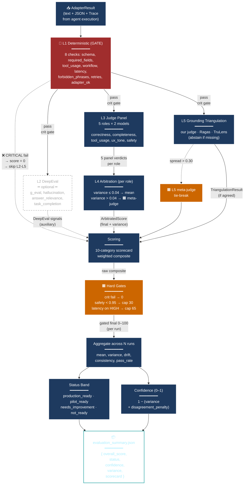
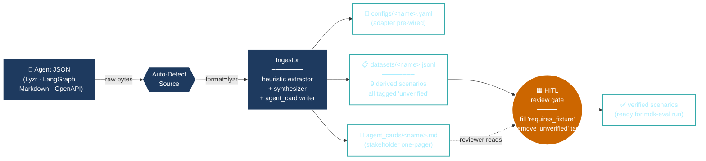

# Mermaid diagrams for draw.io

How to import:
1. In draw.io: **Arrange → Insert → Advanced → Mermaid**
2. Paste the code block (between the ```mermaid fences, without the fences)
3. Click **Insert** — diagram renders as editable shapes
4. Move boxes around, restyle, recolor as needed

Or render directly in GitHub / Notion / VS Code (the markdown previewer renders Mermaid natively).

---

## Diagram 1 — Complete system view

Shows the full pipeline: ingest → HITL → orchestrator → adapter → 5 eval layers → scoring → reporting. Use this for the architecture overview slide.

```mermaid
flowchart TB
    %% ========== INGEST ==========
    AJ["📄 Agent JSON<br/>(Lyzr)"]
    AD{{"Auto Detect<br/>Source"}}
    LI["Lyzr Ingestor<br/>━━━━━━━━<br/>heuristic extractor<br/>scenario synthesizer<br/>agent_card.md"]
    AJ -->|raw bytes| AD
    AD -->|format=lyzr| LI

    %% ========== HITL ==========
    HITL(("🟧 HITL<br/>review gate"))
    LI -->|9 unverified scenarios<br/>+ agent_card.md<br/>+ config.yaml| HITL

    %% ========== CLI + CONFIG ==========
    CLI["CLI (Typer)<br/>━━━━━━━━<br/>init · doctor · run<br/>report · compare · replay<br/>ingest · export"]
    CFG["Config + Validate<br/>+ Auto-Discover<br/>+ Smart Judge Auto-Disable"]
    CLI -->|mdk-eval run| CFG

    %% ========== DATASET + ORCHESTRATOR ==========
    DS["Scenarios / Dataset<br/>(JSONL or YAML)"]
    HITL -->|verified scenarios| DS

    ORCH["Orchestrator<br/>━━━━━━━━<br/>asyncio + bounded concurrency<br/>scenarios × N runs fan-out"]
    CFG --> ORCH
    DS --> ORCH

    %% ========== ADAPTER ==========
    ADAPT["Adapter Layer<br/>━━━━━━━━<br/>mock · REST · openai_compat<br/>Lyzr · LangGraph"]
    ORCH -->|scenario input| ADAPT

    %% ========== EVAL LAYERS ==========
    L1["L1 Deterministic GATE<br/>━━━━━━━━<br/>schema · required_fields<br/>tools · workflow · latency<br/>forbidden_phrases · retries"]
    ADAPT -->|"AdapterResult<br/>(text + JSON + Trace)"| L1

    L2["L2 DeepEval<br/>━ optional ━<br/>g_eval · hallucination<br/>answer_relevance<br/>task_completion"]
    L3["L3 Judge Panel<br/>━━━━━━━━<br/>5 roles × 2 models = 10<br/>correctness · completeness<br/>tool_usage · ux_tone · safety<br/>parallel async"]
    L4["L4 Arbitration<br/>(per role)<br/>━━━━━━━━<br/>variance > 0.04?<br/>→ meta-judge re-judges"]
    L5["L5 Grounding<br/>Triangulation<br/>━━━━━━━━<br/>3 providers parallel<br/>our judge · Ragas · TruLens<br/>spread > 0.30 → meta-judge"]

    L1 -->|pass crit gate| L2
    L1 -->|pass crit gate| L3
    L1 -->|pass crit gate| L5
    L1 -.->|"❌ crit fail<br/>skip downstream<br/>(score=0)"| SCO

    L3 -->|5 verdicts per role| L4

    %% ========== SCORING ==========
    SCO["Scoring<br/>━━━━━━━━<br/>10-category scorecard<br/>weighted composite"]
    L2 -.->|"DeepEval signals<br/>(auxiliary)"| SCO
    L4 -->|"ArbitratedScore per role<br/>(final + variance)"| SCO
    L5 -->|"TriangulationResult<br/>(final + spread + status)"| SCO

    HG["🟧 Hard Gates<br/>━━━━━━━━<br/>safety < 0.95 → cap 30<br/>crit fail → 0<br/>latency on HIGH → cap 65"]
    SCO -->|raw composite| HG

    AGG["Aggregate across runs<br/>━━━━━━━━<br/>mean · variance · drift<br/>consistency · pass_rate"]
    HG -->|gated final 0–100<br/>per run| AGG

    SBD["Status Band<br/>━━━━━━━━<br/>≥90 production_ready<br/>80–89 pilot_ready<br/>70–79 needs_improvement<br/><70 not_ready"]
    CONF["Confidence<br/>━━━━━━━━<br/>1 − (variance<br/>+ disagreement_penalty)"]

    AGG -->|score + variance| SBD
    AGG -->|variance + escalation rate| CONF

    %% ========== REPORTING ==========
    REP["Reporting<br/>(Jinja2)<br/>━━━━━━━━<br/>Movate-branded HTML"]
    SBD --> REP
    CONF --> REP
    AGG --> REP

    OUT["📦 Outputs<br/>━━━━━━━━<br/>report.html · report.pdf<br/>report.json · scenarios.csv<br/>evaluation_summary.json<br/>manifest.json · aggregate.json"]
    REP --> OUT

    %% ========== OBSERVABILITY ==========
    LF[("☁️ Langfuse<br/>(optional)<br/>trace export")]
    ORCH -.->|trace + scores| LF

    %% ========== MANIFEST OVERLAY ==========
    MAN["🟧 Manifest<br/>━━━━━━━━<br/>SHA-256: dataset, config<br/>judge prompts, tool versions<br/>(provenance / replay)"]
    REP --> MAN

    %% ========== STYLING ==========
    classDef trust fill:#cc6600,stroke:#fff,stroke-width:2px,color:#fff
    classDef optional fill:none,stroke:#888,stroke-width:1px,stroke-dasharray:6 4,color:#aaa
    classDef gateNode fill:#a02d2d,stroke:#fff,stroke-width:2px,color:#fff
    classDef artifact fill:none,stroke:#3aa,stroke-width:2px,color:#aef
    classDef ingestion fill:#1e3a5f,stroke:#fff,color:#fff

    class HITL,HG,MAN trust
    class L2,LF optional
    class L1 gateNode
    class OUT artifact
    class AJ,AD,LI,CLI,CFG,DS,ORCH,ADAPT,L3,L4,L5,SCO,AGG,SBD,CONF,REP ingestion
```



---

## Diagram 2 — Eval pipeline detail (zoomed in on L1–L5 + scoring)

Use this for a "how the evaluation actually works" deep-dive slide. Drops the ingest path so you can show layer parallelism clearly.



---

## Diagram 3 — Just the ingest + HITL flow

Useful when you want to explain "how do scenarios get into the system" without distracting from the eval pipeline.



---

## Color legend (use consistently across all three)

| Color | Meaning | Use for |
|-------|---------|---------|
| 🟧 **Movate orange** (`#cc6600`) | Trust gate / human checkpoint / escalation | HITL, Hard Gates, meta-judges, Manifest |
| 🟦 **Deep navy** (`#1e3a5f`) | Core pipeline component | Adapters, Layers, Orchestrator, Scoring |
| 🟥 **Brake red** (`#a02d2d`) | Hard gate / blocking decision | L1 (the gate), Hard Gates summary |
| **Dotted grey** | Optional / graceful no-op | DeepEval, Langfuse, anything in the `[extras]` |
| **Teal outline** (`#3aa`) | Output artifact (file / data product) | Reports, configs, datasets emitted |

---

## Tip — picking which diagram for which audience

| Audience | Diagram | Why |
|----------|---------|-----|
| Executive / sales | **Diagram 1** simplified (hide L2, hide Manifest, hide Langfuse) | Shows the high-level shape without overwhelming |
| Engineering review | **Diagram 1** full | Shows the complete data flow including optional integrations |
| Eval-pipeline deep-dive | **Diagram 2** | Makes parallelism + arbitration explicit |
| Customer onboarding ("how does ingest work?") | **Diagram 3** | Isolates the HITL story |
| AI risk reviewer | **Diagram 1** with HITL + Hard Gates + Manifest highlighted | Trust mechanisms front and center |

---

## If you'd rather not use Mermaid — draw.io XML

draw.io's native format. Paste via **Extras → Edit Diagram → paste XML → OK**. Less readable but more controllable. Let me know if you want me to generate an XML version of any of these.
